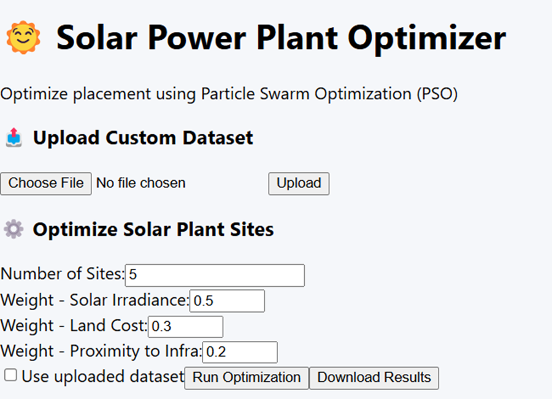
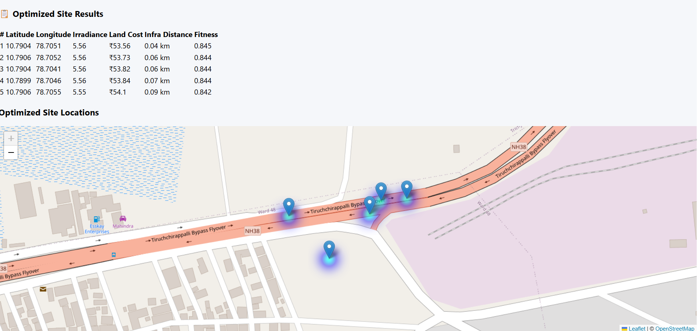

# ☀️ Solar Power Plant Site Selection Optimizer

[](LICENSE)

A full-stack tool using Particle Swarm Optimization (PSO) to identify optimal locations for solar power plants across Tamil Nadu. By evaluating solar irradiance, land cost, and infrastructure distance, this app helps maximize energy potential while minimizing cost and logistic constraints.

---

## 📌 Key Features

- 🌞 Location recommendation using Particle Swarm Optimization (PSO)
- 📍 Upload location dataset with latitude, longitude & factors
- ⚖️ Weight-adjustable scoring for irradiance, land cost, infra distance
- 📊 Real-time optimization with fitness score visualization
- 🗺️ Interactive Leaflet map with heatmap & site plotting
- 📥 Download selected optimal site data as CSV
- 🖥️ Full-stack app with React frontend and FastAPI backend

---

## 🛠️ Tech Stack

### Languages:


### Frontend:


### Backend:


### Optimization Algorithm:


---

## 📁 Project Structure

| File/Folder                  | Description                                      |
|------------------------------|--------------------------------------------------|
| `solar-pso-frontend/`        | React frontend with map view & form inputs       |
| `solar-pso-backend/`         | FastAPI backend for PSO logic & data API         |
| `datasets/sample_sites.csv`  | Sample input dataset                             |
| `outputs/`                   | Exported optimized CSV files                     |
| `main.py` (inside backend)   | API logic & PSO integration                      |
| `app.jsx` (inside frontend)  | Main UI component                               |
| `pso.py`                     | Core PSO algorithm with fitness calculation      |
| `requirements.txt`           | Backend dependencies                             |
| `README.md`                  | Documentation file                               |

---

## 🚀 How to Run

1. **Clone the repository:**
   ```bash
   git clone https://github.com/rog-mithun/Solar-Site-Optimizer.git
   cd solar-site-optimizer

2. **Start the backend (FastAPI):**
   ```bash
   cd solar-pso-backend
   pip install -r requirements.txt
   uvicorn main:app --reload

3. **Start the frontend (React):**
   ```bash
   cd ../solar-pso-frontend
   npm install
   npm start

---

## 🧪 Sample Dataset
- 
- Contains: Latitude, Longitude, Irradiance, Land Cost, Infrastructure Distance
- Used as default input for testing site selection

---

## 📂 Demo & Output Samples

- 
- 

---

## 📖 License

This project is licensed under the [MIT License](LICENSE) © 2025 Mithunsankar S.


